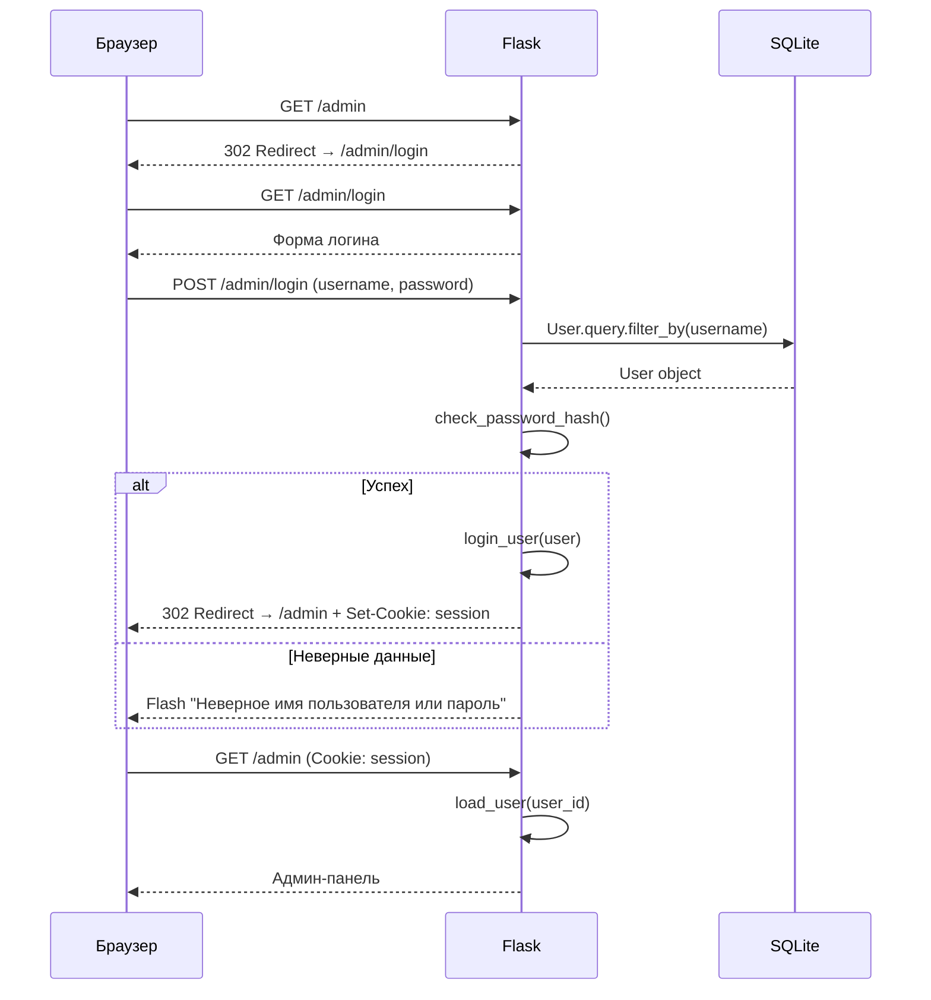

# API-документация

## Контактная форма

### `POST /api/contact`

Принимает заявку через контактную форму на сайте.

**Content-Type:** `application/json`

#### Тело запроса

| Поле | Тип | Обязательное | Описание |
|------|-----|:---:|----------|
| `name` | string | да | Имя отправителя |
| `phone` | string | нет* | Телефон |
| `email` | string | нет* | Email |
| `message` | string | нет | Текст сообщения |
| `subject` | string | нет | Тема заявки |

> \* Необходимо указать хотя бы одно из полей: `phone` или `email`.

#### Успешный ответ — `201 Created`

```json
{
  "success": true,
  "message": "Заявка успешно отправлена!"
}
```

#### Ошибка валидации — `400 Bad Request`

```json
{
  "success": false,
  "error": "Поле \"Имя\" обязательно."
}
```

Возможные сообщения об ошибке:
- `"Неверный формат данных."` — тело запроса не является JSON
- `"Поле \"Имя\" обязательно."` — отсутствует `name`
- `"Укажите телефон или email."` — не указаны ни `phone`, ни `email`

#### Примеры curl

**Успешная отправка:**

```bash
curl -X POST http://localhost:5001/api/contact \
  -H "Content-Type: application/json" \
  -d '{
    "name": "Иван Петров",
    "phone": "+7 (999) 123-45-67",
    "email": "ivan@example.com",
    "message": "Интересует сотрудничество",
    "subject": "Партнёрство"
  }'
```

**Ответ:**
```json
{"success": true, "message": "Заявка успешно отправлена!"}
```

**Ошибка — без имени:**

```bash
curl -X POST http://localhost:5001/api/contact \
  -H "Content-Type: application/json" \
  -d '{"phone": "+7 (999) 123-45-67"}'
```

**Ответ:**
```json
{"success": false, "error": "Поле \"Имя\" обязательно."}
```

**Ошибка — без контактов:**

```bash
curl -X POST http://localhost:5001/api/contact \
  -H "Content-Type: application/json" \
  -d '{"name": "Иван"}'
```

**Ответ:**
```json
{"success": false, "error": "Укажите телефон или email."}
```

---

## Авторизация

Проект использует **Flask-Login** для сессионной аутентификации на основе cookies.

### Поток авторизации



### Защита маршрутов

Админ-панель защищена через `AuthMixin`:

```python
class AuthMixin:
    def is_accessible(self):
        return current_user.is_authenticated and current_user.is_admin

    def inaccessible_callback(self, name, **kwargs):
        return redirect(url_for('auth.login'))
```

Все admin-views (`BlogPostView`, `VacancyView`, `ProjectView`, `ContactView`, `UserView`) наследуют `AuthMixin`, проверяя:
1. Пользователь аутентифицирован (`is_authenticated`)
2. Пользователь является администратором (`is_admin == True`)

### Endpoints авторизации

| Метод | URL | Описание |
|-------|-----|----------|
| GET | `/admin/login` | Форма входа |
| POST | `/admin/login` | Обработка входа (username + password) |
| GET | `/admin/logout` | Выход из системы |

### Хранение паролей

Пароли хешируются через `werkzeug.security.generate_password_hash()` (PBKDF2 по умолчанию). Проверка — через `check_password_hash()`.
