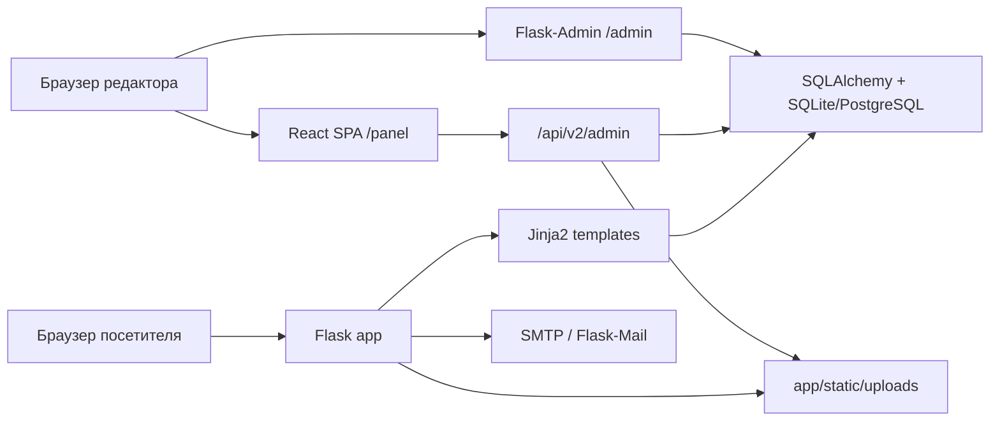
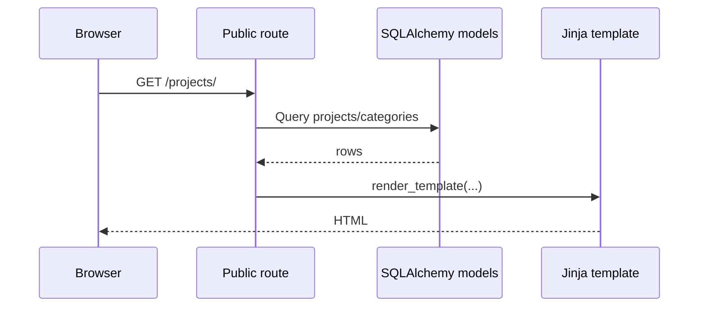
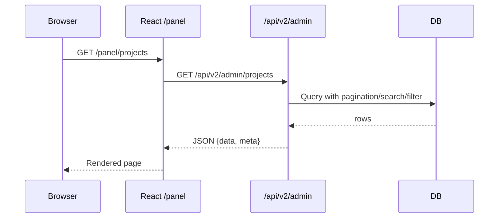
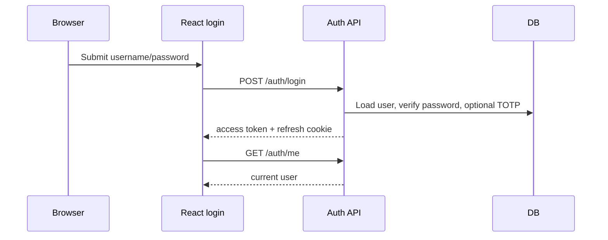

# Архитектура Проекта

## Общая Схема



## Архитектурный Профиль

Проект представляет собой Flask-монолит с тремя интерфейсными слоями:

- server-rendered публичный сайт;
- React SPA для основной административной работы;
- legacy Flask-Admin для совместимости.

Ключевой эффект такой структуры: бизнес-данные, аутентификация и работа с файлами централизованы в одном backend, а интерфейсы поверх него могут развиваться независимо.

## Точка Входа И Инициализация

Приложение создаётся через `create_app()` в `app/__init__.py`.

Во время инициализации backend:

- загружает `Config` из `config.py`;
- создаёт папку загрузок `UPLOAD_FOLDER`;
- инициализирует `db`, `login_manager`, `migrate`, `jwt`, `limiter`, `ma`, `mail`;
- подключает JWT handlers и Jinja filters;
- регистрирует blueprints;
- инициализирует Flask-Admin;
- настраивает SPA catch-all для `/panel/`;
- регистрирует error handlers `404` и `500`.

Dev entrypoint: `run.py`, порт по умолчанию `5001`.

## HTTP-Поверхности

### 1. Публичный сайт

Blueprints:

| Blueprint | Prefix | Ответ |
|-----------|--------|-------|
| `main` | `/` | Jinja-страницы: главная, about, projects, documents, equipment, robots, sitemap |
| `blog` | `/blog` | Список и детали статей |
| `vacancies` | `/vacancies` | Список и детали вакансий |
| `api` | `/api` | Публичный JSON endpoint контактной формы |

Публичный слой тянет данные напрямую из SQLAlchemy-моделей и рендерит HTML через `render_template()`.

### 2. Основная админка

Основной admin UI состоит из двух частей:

- React SPA, собранная в `app/static/panel/` и доступная по `/panel/`;
- backend API под `/api/v2/admin`.

Flask только раздаёт собранный SPA bundle и отдаёт `index.html` для внутренних маршрутов React Router.

### 3. Legacy-админка

`/admin/` построен на Flask-Admin и покрывает только ограниченный набор сущностей:

- BlogPost
- Vacancy
- Project
- ContactSubmission
- User

Этот контур полезен как резервный интерфейс и как исторически ранняя админка, но не отражает полный функционал проекта.

## Аутентификация И Авторизация

### Публичный сайт

Анонимный доступ. Исключение: форма входа в legacy `/admin/login`.

### Legacy `/admin`

Используется `Flask-Login`:

- логин через `/admin/login`;
- загрузка пользователя через `login_manager.user_loader`;
- защита Flask-Admin views через `AuthMixin`;
- условие доступа: `current_user.is_authenticated and current_user.is_admin`.

### `/panel` и `/api/v2/admin`

Используется JWT-авторизация:

- access token отдаётся в JSON и хранится клиентом в памяти;
- refresh token устанавливается cookie;
- refresh flow обслуживается `/api/v2/admin/auth/refresh`;
- logout пишет JTI в `TokenBlocklist`;
- 2FA реализована на TOTP через `pyotp` и QR-код через `qrcode`;
- login rate limit берётся из `AUTH_RATE_LIMIT`.

Текущий нюанс реализации:

- route-level защита построена в основном на `@admin_required`;
- модельные `Role` и `Permission` уже есть;
- декоратор `permission_required()` объявлен, но массово в маршрутах пока не применяется.

## Слой Данных

SQLAlchemy-модели делятся на четыре группы:

- контент и каталог: `BlogPost`, `Project`, `ProjectImage`, `Vacancy`, `Service`, `Document`, `Testimonial`, `Equipment`, `Tag`;
- заявки и коммуникация: `ContactSubmission`, `Notification`;
- доступ и безопасность: `User`, `Role`, `Permission`, `UserSession`, `TokenBlocklist`;
- операционный слой CMS: `AuditLog`, `Draft`, `SiteSetting`.

Подробнее см. [database.md](database.md).

## Повторно Используемые Backend-Паттерны

### Application Factory

Позволяет:

- создавать приложение для shell, тестов и CLI;
- централизованно инициализировать extensions;
- избегать ранних циклических импортов.

### Extensions Pattern

Инстансы extensions живут в `app/extensions.py` и подключаются позже через `init_app()`.

### Generic CRUD Helpers

`app/routes/admin_api/crud_helpers.py` даёт общий слой для:

- пагинации;
- стандартных JSON-ответов;
- create/update/delete;
- bulk delete и bulk toggle;
- истории изменений через audit log.

Это делает admin API консистентным и снижает дублирование между route-модулями.

### Schema-Driven Validation

Marshmallow-схемы в `app/schemas/` отвечают за:

- валидацию входных данных;
- сериализацию JSON-ответов;
- ограничение dump/load полей.

## Служебные Подсистемы

### Audit Log

Каждое значимое действие в admin API может писать запись в `AuditLog` через `log_action()`:

- create;
- update;
- delete;
- login;
- logout;
- rollback отдельных сущностей.

### Drafts

Черновики хранятся в таблице `drafts` и доступны через `/api/v2/admin/drafts/<entity_type>/<entity_id>`.

### Search

Глобальный поиск агрегирует результаты по blog posts, vacancies, projects и contacts и возвращает ссылки прямо на SPA-маршруты.

### Uploads И Image Pipeline

Загруженные файлы кладутся в `app/static/uploads/`.

Для изображений backend:

- сохраняет оригинал;
- пытается сделать WebP-версию;
- генерирует thumbnail;
- использует тот же пайплайн в `import_photos.py`.

### Mail

Публичная форма `POST /api/contact` сохраняет заявку в БД и пытается отправить email-уведомление через Flask-Mail, если SMTP-настройки заданы.

## Потоки Запросов

### Публичная страница



### SPA-админка



### Логин В `/panel`



## Структура Репозитория

```text
app/
  __init__.py          фабрика приложения и SPA catch-all
  extensions.py        db, login_manager, migrate, jwt, limiter, ma, mail
  models/              SQLAlchemy-модели
  schemas/             Marshmallow-схемы
  routes/              публичные и admin API blueprints
  admin/               Flask-Admin
  services/            audit helpers
  templates/           Jinja templates и email templates
  static/              CSS, JS, изображения, uploads, built SPA

admin-panel/
  src/api/             client и feature APIs
  src/pages/           страницы SPA
  src/components/      layout, tables, editors, shared UI
  src/hooks/           CRUD hooks, debounce, auth helpers
  src/contexts/        auth/theme/sidebar contexts

migrations/
  Alembic env и версии миграций
```

## Что Важно Учитывать При Разработке

- `/panel` и `/admin` используют разные auth-механизмы;
- не весь RBAC пока enforced на уровне route decorators;
- SPA зависит от build output в `app/static/panel`;
- часть публичного фронтенда и legacy-админки зависит от внешних CDN;
- админский API и публичный сайт используют одни и те же модели, поэтому изменения схемы сразу затрагивают оба контура.
