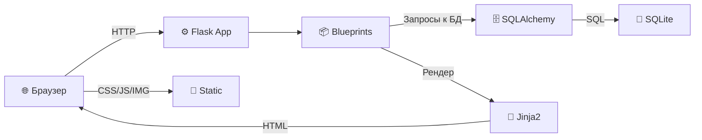
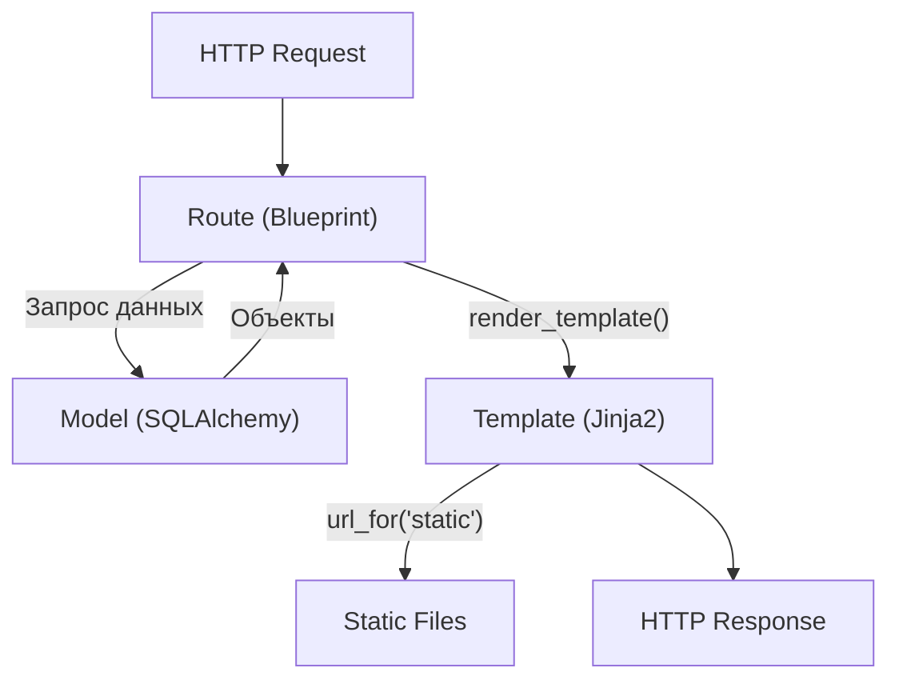

# Архитектура проекта

## Общая схема



## Паттерны

### Application Factory

Приложение создаётся через функцию `create_app()` в `app/__init__.py`. Это позволяет:
- Создавать несколько экземпляров приложения (тестирование)
- Конфигурировать приложение через разные классы конфигурации
- Инициализировать расширения без циклических импортов

### Blueprints

Маршруты разделены на модули (blueprints) по функциональным областям:

| Blueprint | Prefix | Файл | Назначение |
|-----------|--------|------|------------|
| `main` | `/` | `app/routes/main.py` | Главная, О нас, Проекты, robots.txt, sitemap.xml |
| `blog` | `/blog` | `app/routes/blog.py` | Список статей, детальная статья |
| `vacancies` | `/vacancies` | `app/routes/vacancies.py` | Список вакансий, детальная вакансия |
| `auth` | `/` | `app/routes/auth.py` | Логин/логаут администратора |
| `api` | `/api` | `app/routes/api.py` | REST API контактной формы |
| Flask-Admin | `/admin` | `app/admin/views.py` | Административная панель |

### Jinja2 Template Inheritance

Все страницы наследуют базовый шаблон `base.html`, переопределяя нужные блоки. Общие элементы (header, footer, карточки) вынесены в компоненты.

### Extensions Pattern

Расширения Flask создаются в `app/extensions.py` без привязки к приложению, а затем инициализируются в фабрике через `ext.init_app(app)`.

## Структура директорий

```
ОлмаСТРОЙ/
├── app/                          # Пакет приложения
│   ├── __init__.py               # Application Factory (create_app)
│   ├── extensions.py             # Инстансы Flask-расширений (db, login_manager, migrate, ckeditor)
│   ├── utils.py                  # Утилиты (process_image — обработка изображений)
│   │
│   ├── models/                   # SQLAlchemy-модели
│   │   ├── __init__.py           # Реэкспорт всех моделей
│   │   ├── user.py               # User (аутентификация)
│   │   ├── blog.py               # BlogPost (статьи блога)
│   │   ├── vacancy.py            # Vacancy (вакансии)
│   │   ├── project.py            # Project (проекты)
│   │   └── contact.py            # ContactSubmission (заявки)
│   │
│   ├── routes/                   # Маршруты (blueprints)
│   │   ├── __init__.py           # register_blueprints()
│   │   ├── main.py               # Главная, О нас, Проекты, SEO
│   │   ├── blog.py               # Блог
│   │   ├── vacancies.py          # Вакансии
│   │   ├── auth.py               # Авторизация
│   │   └── api.py                # REST API
│   │
│   ├── admin/                    # Административная панель
│   │   ├── __init__.py           # init_admin() — регистрация views
│   │   └── views.py              # ModelView для каждой модели
│   │
│   ├── templates/                # Jinja2-шаблоны
│   │   ├── base.html             # Базовый шаблон (12 блоков)
│   │   ├── index.html            # Главная страница
│   │   ├── about.html            # О компании
│   │   ├── sitemap.xml           # XML-карта сайта (шаблон)
│   │   ├── components/           # Переиспользуемые компоненты
│   │   │   ├── _header.html      # Шапка + навигация
│   │   │   ├── _footer.html      # Подвал
│   │   │   ├── _ticker.html      # Бегущая строка
│   │   │   ├── _breadcrumbs.html # Хлебные крошки (макрос)
│   │   │   ├── _pagination.html  # Пагинация (макрос)
│   │   │   ├── _blog_card.html   # Карточка статьи (макрос)
│   │   │   ├── _vacancy_card.html# Карточка вакансии (макрос)
│   │   │   ├── _project_card.html# Карточка проекта (макрос)
│   │   │   └── _picture.html     # WebP-картинка с fallback (макрос)
│   │   ├── blog/                 # Шаблоны блога
│   │   │   ├── list.html
│   │   │   └── detail.html
│   │   ├── vacancies/            # Шаблоны вакансий
│   │   │   ├── list.html
│   │   │   └── detail.html
│   │   ├── projects/             # Шаблоны проектов
│   │   │   ├── list.html
│   │   │   └── detail.html
│   │   ├── auth/                 # Шаблон логина
│   │   │   └── login.html
│   │   ├── admin/                # Шаблоны админки
│   │   │   ├── master.html
│   │   │   ├── index.html
│   │   │   ├── blog_create.html
│   │   │   ├── blog_edit.html
│   │   │   ├── vacancy_create.html
│   │   │   └── vacancy_edit.html
│   │   └── errors/               # Страницы ошибок
│   │       ├── 404.html
│   │       └── 500.html
│   │
│   └── static/                   # Статические файлы
│       ├── css/
│       │   ├── style.css         # Основные стили (~1419 строк)
│       │   └── admin-custom.css  # Стили админки
│       ├── js/
│       │   ├── main.js           # Основной JavaScript (11 функций)
│       │   └── mobile-nav.js     # Мобильная навигация
│       └── img/
│           ├── logo.svg          # Логотип
│           ├── logo-icon.svg     # Иконка логотипа
│           ├── og-default.jpg    # OG-изображение по умолчанию
│           ├── hero-bg.jpg       # Фон героя
│           ├── hero-bg.webp      # Фон героя (WebP)
│           └── projects/         # Изображения проектов (JPG + WebP)
│
├── migrations/                   # Alembic миграции
├── docs/                         # Документация
├── config.py                     # Конфигурация приложения
├── run.py                        # Точка входа (запуск dev-сервера, порт 5001)
├── seed.py                       # Начальные данные (admin + контент)
├── requirements.txt              # Python-зависимости (11 пакетов)
├── .env                          # Переменные окружения
└── olmastroy.db                  # Файл базы данных SQLite
```

## Схема взаимодействия



## Расширения Flask

| Расширение | Инстанс | Назначение |
|-----------|---------|------------|
| Flask-SQLAlchemy | `db` | ORM, работа с базой данных |
| Flask-Login | `login_manager` | Сессионная аутентификация |
| Flask-Migrate | `migrate` | Миграции базы данных (Alembic) |
| Flask-CKEditor | `ckeditor` | WYSIWYG-редактор в админке |

Все инстансы создаются в `app/extensions.py` и инициализируются в `create_app()`.

## Кастомные Jinja2-фильтры

| Фильтр | Пример | Результат |
|--------|--------|-----------|
| `ru_date` | `{{ post.created_at\|ru_date }}` | `15 января 2025` |
| `reading_time` | `{{ post.content\|reading_time }}` | `3 мин.` |

## Context Processor

Функция `inject_now()` добавляет `now` (текущее время) во все шаблоны. Используется в футере для отображения года: `© 2006—{{ now().year }}`.
