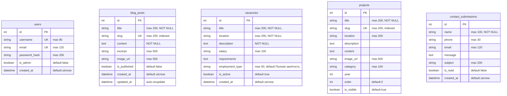

# База данных

## ER-диаграмма



> Связей между таблицами нет — каждая модель является самостоятельной сущностью.

## Таблицы

### `users` — Пользователи

Хранит учётные записи администраторов. Пароли хешируются через `werkzeug.security`.

| Поле | Тип | Constraints | Описание |
|------|-----|-------------|----------|
| `id` | Integer | PK, autoincrement | Идентификатор |
| `username` | String(80) | UNIQUE, NOT NULL | Логин |
| `email` | String(120) | UNIQUE, NOT NULL | Email |
| `password_hash` | String(256) | NOT NULL | Хеш пароля (Werkzeug) |
| `is_admin` | Boolean | default=False | Флаг администратора |
| `created_at` | DateTime | default=utcnow | Дата регистрации |

**Методы модели:**
- `set_password(password)` — хеширует и сохраняет пароль
- `check_password(password)` — проверяет пароль

### `blog_posts` — Статьи блога

| Поле | Тип | Constraints | Описание |
|------|-----|-------------|----------|
| `id` | Integer | PK, autoincrement | Идентификатор |
| `title` | String(200) | NOT NULL | Заголовок |
| `slug` | String(200) | UNIQUE, indexed, NOT NULL | URL-адрес (транслит) |
| `content` | Text | NOT NULL | HTML-контент (CKEditor) |
| `excerpt` | String(500) | — | Краткое описание |
| `image_url` | String(500) | — | URL изображения |
| `is_published` | Boolean | default=False | Статус публикации |
| `created_at` | DateTime | default=utcnow | Дата создания |
| `updated_at` | DateTime | auto onupdate | Дата обновления |

**Автогенерация slug:** Метод `generate_slug(title)` транслитерирует кириллицу по собственной таблице `TRANSLIT_MAP` (41 символ). Пример: `«Новые технологии»` → `novye-tekhnologii`.

### `vacancies` — Вакансии

| Поле | Тип | Constraints | Описание |
|------|-----|-------------|----------|
| `id` | Integer | PK, autoincrement | Идентификатор |
| `title` | String(200) | NOT NULL | Название должности |
| `location` | String(200) | NOT NULL | Местоположение |
| `description` | Text | NOT NULL | HTML-описание |
| `salary` | String(100) | — | Зарплата (текстом) |
| `requirements` | Text | — | HTML-требования |
| `employment_type` | String(50) | default=«Полная занятость» | Тип занятости |
| `is_active` | Boolean | default=True | Активна ли вакансия |
| `created_at` | DateTime | default=utcnow | Дата создания |

**Типы занятости:** Полная занятость, Частичная занятость, Вахта, Стажировка.

### `projects` — Проекты

| Поле | Тип | Constraints | Описание |
|------|-----|-------------|----------|
| `id` | Integer | PK, autoincrement | Идентификатор |
| `title` | String(200) | NOT NULL | Название проекта |
| `slug` | String(200) | UNIQUE, indexed | URL-адрес (транслит) |
| `location` | String(200) | — | Местоположение |
| `description` | Text | — | Краткое описание |
| `content` | Text | — | Полное HTML-описание |
| `image_url` | String(500) | — | URL изображения |
| `category` | String(100) | — | Категория |
| `year` | Integer | — | Год реализации |
| `order` | Integer | default=0 | Порядок сортировки |
| `is_visible` | Boolean | default=True | Видимость на сайте |

### `contact_submissions` — Заявки

| Поле | Тип | Constraints | Описание |
|------|-----|-------------|----------|
| `id` | Integer | PK, autoincrement | Идентификатор |
| `name` | String(100) | NOT NULL | Имя отправителя |
| `phone` | String(30) | — | Телефон |
| `email` | String(120) | — | Email |
| `message` | Text | — | Сообщение |
| `subject` | String(200) | — | Тема |
| `is_read` | Boolean | default=False | Прочитано ли |
| `created_at` | DateTime | default=utcnow | Дата отправки |

## Миграции

Проект использует **Flask-Migrate** (обёртка над Alembic).

```bash
# Инициализация (только при первом запуске)
flask db init

# Создать миграцию после изменения моделей
flask db migrate -m "описание изменений"

# Применить миграции
flask db upgrade

# Откатить последнюю миграцию
flask db downgrade
```

## Сидирование

Скрипт `seed.py` заполняет базу начальными данными:

```bash
python seed.py
```

Создаёт:
- **Администратор:** `admin` / `admin123` (email: `admin@olmastroy.ru`)
- **3 статьи блога** — КС Байдарацкая, Новые технологии, Расширение географии
- **3 вакансии** — Инженер-строитель (Калининград), Сварщик НАКС (ЯНАО), Проектировщик ОВиК (Москва)
- **3 проекта** — КС «Байдарацкая», Сила Сибири, Подземное хранилище газа

Скрипт идемпотентный — при повторном запуске пропускает уже существующие записи.

## Файл базы данных

SQLite-база хранится в файле `olmastroy.db` в корне проекта. Путь задаётся переменной окружения `DATABASE_URL` (по умолчанию: `sqlite:///olmastroy.db`).
