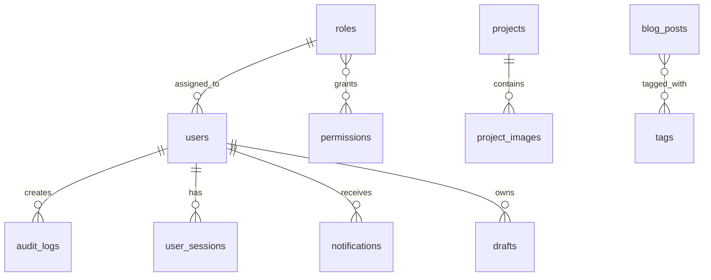

# База Данных

Проект использует SQLAlchemy через Flask-SQLAlchemy. По умолчанию backend работает с SQLite-файлом `olmastroy.db`, но URI может быть переопределён через `DATABASE_URL`.

## Общие Правила

- ORM: SQLAlchemy через `db.Model`;
- миграции: Flask-Migrate + Alembic;
- дефолтная БД: SQLite;
- production-альтернатива: PostgreSQL;
- часть полей хранит JSON либо в native JSON-колонках, либо в текстовом виде.

## Карта Сущностей



## Контент И Каталог

| Таблица | Назначение | Ключевые поля | Где используется |
|---------|------------|---------------|------------------|
| `blog_posts` | Статьи блога | `title`, `slug`, `content`, `excerpt`, `image_url`, `is_published`, `publish_at`, SEO-поля | Публичный блог, admin API, legacy admin |
| `tags` | Теги для блога | `name`, `slug` | Фильтр публичного блога, редактор SPA |
| `post_tags` | M2M-таблица блог-постов и тегов | `post_id`, `tag_id` | Связка статей и тегов |
| `vacancies` | Вакансии | `title`, `location`, `description`, `requirements`, `salary`, `employment_type`, `is_active` | Публичные вакансии, admin API, legacy admin |
| `projects` | Проекты компании | `title`, `slug`, `location`, `description`, `content`, `category`, `year`, `order`, `is_visible`, SEO-поля | Главная, каталог проектов, admin API, legacy admin |
| `project_images` | Галерея проекта | `project_id`, `image_url`, `caption`, `order` | Лента фото на главной, карточка проекта, SPA project gallery |
| `services` | Услуги на главной | `title`, `description`, `icon`, `order`, `is_active` | Главная страница и SPA |
| `documents` | Документы и разрешительная информация | `title`, `description`, `file_url`, `category`, `order`, `is_visible` | Публичная страница `/documents/`, SPA |
| `testimonials` | Отзывы клиентов и партнёров | `company_name`, `author`, `text`, `image_url`, `rating`, `order`, `is_visible` | Главная, SPA |
| `equipment` | Каталог техники | `name`, `description`, `image_url`, `category`, `specs`, `is_available`, `order` | Публичная страница `/equipment/`, SPA |
| `contact_submissions` | Заявки с сайта | `name`, `phone`, `email`, `message`, `subject`, `is_read`, `created_at` | `POST /api/contact`, раздел заявок в SPA и legacy admin |

### Детали По Контентным Сущностям

#### `blog_posts`

- `slug` генерируется из `title`;
- публикация регулируется парой `is_published` + `publish_at`;
- `meta_title` и `meta_description` используются для SEO;
- связь с `tags` двусторонняя.

#### `projects`

- `slug` генерируется из `title`;
- `order` задаёт ручную сортировку;
- `is_visible` управляет публикацией на сайте;
- у проекта может быть и `image_url`, и отдельная галерея `project_images`.

#### `equipment`

- `specs` хранится как текст, фактически ожидается JSON-строка;
- в публичном каталоге показываются только записи с `is_available=True`.

## Доступ, Безопасность И Сессии

| Таблица | Назначение | Ключевые поля | Где используется |
|---------|------------|---------------|------------------|
| `users` | Учётные записи администраторов | `username`, `email`, `password_hash`, `is_admin`, `role_id`, `is_2fa_enabled`, `totp_secret`, `avatar_url`, `last_login`, `is_active` | `/panel`, `/admin`, audit |
| `roles` | Роли пользователей | `name`, `description`, `is_system` | SPA управление ролями |
| `permissions` | Отдельные права | `codename`, `name`, `group` | Seed, роли, будущий route-level RBAC |
| `role_permissions` | M2M ролей и permissions | `role_id`, `permission_id` | RBAC |
| `user_sessions` | Активные refresh-сессии | `user_id`, `jti`, `ip_address`, `device_info`, `last_active`, `is_active` | `/auth/login`, `/auth/refresh`, раздел sessions |
| `token_blocklist` | Заблокированные JWT | `jti`, `type`, `created_at` | logout и принудительное завершение сессий |

### Нюансы

- `users.is_admin` сейчас даёт полный доступ через `@admin_required`;
- `role_id` и permissions уже существуют и сидируются;
- `permission_required()` объявлен, но используется не массово, поэтому фактическое разграничение прав пока мягче, чем модель данных.

## Операционный Слой CMS

| Таблица | Назначение | Ключевые поля | Где используется |
|---------|------------|---------------|------------------|
| `audit_logs` | История действий | `user_id`, `action`, `entity_type`, `entity_id`, `changes`, `ip_address`, `created_at` | Dashboard activity, история, rollback |
| `drafts` | Черновики форм | `user_id`, `entity_type`, `entity_id`, `data`, `updated_at` | API автосохранения |
| `notifications` | Уведомления в SPA | `user_id`, `title`, `message`, `type`, `link`, `is_read` | Колокол уведомлений, список уведомлений |
| `site_settings` | Настройки сайта | `key`, `value`, `value_type`, `group`, `label`, `description`, `order` | Settings page, runtime-конфигурация контента |

### `audit_logs`

`changes` хранится как JSON вида:

```json
{
  "title": { "old": "Старое", "new": "Новое" },
  "is_visible": { "old": "False", "new": "True" }
}
```

История используется для:

- ленты активности на dashboard;
- просмотра истории blog posts, vacancies и projects;
- rollback blog posts по записи аудита.

### `site_settings`

`value_type` поддерживает:

- `string`
- `text`
- `boolean`
- `number`
- `json`

Typed value вычисляется в модели методом `get_typed_value()`.

## Seed-Данные

`seed.py` создаёт:

- permissions по бизнес-группам;
- системные роли `Администратор`, `Редактор`, `Наблюдатель`;
- пользователя `admin`;
- базовые `site_settings`;
- стартовые статьи блога;
- стартовые вакансии;
- стартовые проекты.

Seed идемпотентен: при повторном запуске существующие записи не дублируются, а часть данных аккуратно обновляется.

## Миграции

В репозитории уже есть Alembic-окружение и миграции:

- `234a2a46140b_add_slug_and_content_to_project.py`
- `c0517f373770_add_project_images_table.py`
- `eb67fd96667f_add_admin_panel_v2_models_roles_.py`

Базовые команды:

```bash
flask --app run.py db upgrade
flask --app run.py db migrate -m "описание"
flask --app run.py db downgrade
```

## Практические Замечания

- SQLite подходит для локальной разработки и простого стенда, но ограничен для production-нагрузки.
- Любое изменение моделей влияет одновременно на публичный сайт, admin API и часто на React SPA.
- Перед изменением схемы полезно проверить `seed.py`, `app/schemas/`, связанные admin API routes и публичные Jinja-шаблоны.
