# Фронтенд

## Карта страниц

| URL | Шаблон | Название | Описание |
|-----|--------|----------|----------|
| `/` | `index.html` | Главная | Hero, тикер, проекты, услуги, блог, контактная форма |
| `/about/` | `about.html` | О компании | История, цифры, география, партнёры, таймлайн |
| `/projects/` | `projects/list.html` | Проекты | Грид с фильтрацией по категории |
| `/projects/<slug>` | `projects/detail.html` | Проект | Детальная страница проекта |
| `/blog/` | `blog/list.html` | Блог | Список статей с пагинацией (9 на страницу) |
| `/blog/<slug>` | `blog/detail.html` | Статья | Детальная страница статьи |
| `/vacancies/` | `vacancies/list.html` | Вакансии | Список с фильтрацией по локации |
| `/vacancies/<id>` | `vacancies/detail.html` | Вакансия | Описание, требования, форма отклика |
| `/admin/login` | `auth/login.html` | Вход | Форма авторизации администратора |
| `/admin/` | `admin/index.html` | Dashboard | Статистика контента |
| `/robots.txt` | _(генерируется)_ | — | Инструкции для поисковых роботов |
| `/sitemap.xml` | `sitemap.xml` | — | XML-карта сайта |

**Страницы ошибок:** `errors/404.html`, `errors/500.html`

## Template Inheritance

```mermaid
flowchart TD
    base["base.html"]
    base -->|extends| index["index.html"]
    base -->|extends| about["about.html"]
    base -->|extends| blog_list["blog/list.html"]
    base -->|extends| blog_detail["blog/detail.html"]
    base -->|extends| vac_list["vacancies/list.html"]
    base -->|extends| vac_detail["vacancies/detail.html"]
    base -->|extends| proj_list["projects/list.html"]
    base -->|extends| proj_detail["projects/detail.html"]
    base -->|extends| login["auth/login.html"]
    base -->|extends| err404["errors/404.html"]
    base -->|extends| err500["errors/500.html"]

    base -->|include| header["components/_header.html"]
    base -->|include| footer["components/_footer.html"]

    blog_list -->|import| blog_card["components/_blog_card.html"]
    vac_list -->|import| vac_card["components/_vacancy_card.html"]
    proj_list -->|import| proj_card["components/_project_card.html"]

    blog_list -->|import| pagination["components/_pagination.html"]
    blog_detail -->|import| breadcrumbs["components/_breadcrumbs.html"]
    vac_detail -->|import| breadcrumbs
    proj_detail -->|import| breadcrumbs
```



### Блоки base.html

| Блок | Назначение | Пример переопределения |
|------|------------|----------------------|
| `title` | Заголовок страницы | `Блог` |
| `meta_description` | Meta description | SEO-описание |
| `og_title` | OG-заголовок | Заголовок статьи |
| `og_description` | OG-описание | Краткое описание |
| `og_image` | OG-изображение | Изображение статьи |
| `og_type` | OG-тип | `article` |
| `twitter_title` | Twitter Card title | — |
| `twitter_description` | Twitter Card description | — |
| `json_ld_extra` | Дополнительная JSON-LD разметка | Article, JobPosting |
| `extra_css` | Дополнительные CSS | CKEditor стили |
| `content` | Основной контент страницы | — |
| `extra_js` | Дополнительные скрипты | — |

## Компоненты (макросы)

### `_header.html`
Шапка сайта. Содержит логотип (`logo-icon.svg` + текст «ОЛМАСТРОЙ»), навигацию (О нас, Проекты, Услуги, Блог, Вакансии, Контакты), кнопку-гамбургер для мобильных устройств и оверлей мобильного меню.

### `_footer.html`
Подвал. Юридическая информация (ООО «ОлмаСтрой», ИНН, ОГРН), контактный email (`info@olmastroy.ru`), телефон (`+7 (4012) 311-668`). Год обновляется автоматически через `{{ now().year }}`.

### `_ticker.html`
Бегущая строка с названиями проектов: ГАЗПРОМ, СИЛА СИБИРИ, ЯМАЛ, БАЙДАРАЦКАЯ, СЕВЕРО-ЕВРОПЕЙСКИЙ ГАЗОПРОВОД. Дублируется для бесшовной CSS-анимации. Скрыта от screen readers (`aria-hidden="true"`).

### `_breadcrumbs.html`
**Макрос** `breadcrumbs(items)`. Принимает список `[{title, url}]`. Генерирует хлебные крошки с микроразметкой Schema.org (`BreadcrumbList`). «Главная» добавляется автоматически.

### `_pagination.html`
**Макрос** `render_pagination(pagination)`. Принимает объект Flask-SQLAlchemy `Pagination`. Отрисовывает стрелки, номера страниц и многоточие (`…`).

### `_blog_card.html`
**Макрос** карточки статьи блога. Отображает изображение, дату (`ru_date`), заголовок, краткое описание, время чтения (`reading_time`).

### `_vacancy_card.html`
**Макрос** карточки вакансии. Отображает должность, локацию, тип занятости, зарплату.

### `_project_card.html`
**Макрос** карточки проекта. Отображает изображение (grayscale → цветное при hover), название, локацию, год.

### `_picture.html`
**Макрос** для адаптивного изображения. Генерирует `<picture>` с WebP-версией (`<source type="image/webp">`) и JPG-fallback.

## CSS

### Файл: `app/static/css/style.css` (~1419 строк)

#### CSS-переменные

```css
:root {
    --c-blue: #086EB5;      /* Корпоративный синий */
    --c-lime: #CBFE0A;      /* Акцентный лайм */
    --c-white: #FFFFFF;
    --c-dark: #111418;      /* Тёмный фон */
    --c-gray: #F3F5F7;      /* Светлый фон секций */
    --font-main: 'Manrope', sans-serif;
    --font-head: 'Oswald', sans-serif;
    --gap: 20px;
    --container: 1400px;
    --ease: cubic-bezier(0.23, 1, 0.32, 1);
}
```

#### Ключевые секции

| Секция | Строки | Описание |
|--------|--------|----------|
| Core Variables & Reset | 1–29 | CSS-переменные, сброс стилей |
| Preloader | 32–70 | Анимация прелоадера |
| Scroll Progress | 73–82 | Полоса прогресса скролла |
| Utilities | 85–96 | Контейнер, утилиты |
| Header | 99–137 | Шапка, навигация |
| Hero | 140–213 | Главный экран, slowZoom |
| Ticker | 216–239 | Бегущая строка (marquee) |
| About & Stats | 242–253 | Секция «О нас», карточки статистики |
| Projects | 256–284 | Секция проектов |
| Services | 287–300 | Секция услуг |
| Contacts | 303–331 | Секция контактов, форма |
| Footer | 334–343 | Подвал |
| Blog Grid | 350–433 | Сетка блога, карточки |
| Vacancy Card | 436–486 | Карточки вакансий |
| Breadcrumbs | 489–510 | Хлебные крошки |
| Pagination | 513–545 | Пагинация |
| Login Card | 548–576 | Форма входа |
| Prose | 579–662 | Типографика статей |
| Filter Tags | 665–686 | Теги фильтрации |
| Stat Card | 689–716 | Карточки статистики |
| Hamburger | 719–744 | Кнопка мобильного меню |
| Mobile Nav | 747–783 | Мобильное меню |
| Flash Messages | 786–832 | Уведомления |
| Page Hero | 855–869 | Hero внутренних страниц |
| Blog Detail Hero | 872–899 | Hero статьи |
| Vacancy Detail | 902–938 | Детальная вакансия |
| Timeline | 1060–1109 | Таймлайн (О нас) |
| Geography Grid | 1112–1139 | Сетка географии |
| Partners Grid | 1142–1170 | Сетка партнёров |
| Scroll Top & Cookie | 1250–1312 | Кнопка «Наверх», cookie-баннер |
| Responsive | 1315–1418 | Адаптивные стили |

### Шрифты

| Шрифт | Использование | Начертания |
|-------|--------------|------------|
| **Manrope** | Основной текст, UI | 300, 400, 500, 700, 800 |
| **Oswald** | Заголовки (uppercase) | 400, 500, 700 |

Подключены через Google Fonts с `preconnect` для ускорения загрузки.

### Адаптивность

| Брейкпоинт | Что меняется |
|-----------|-------------|
| `≤ 1024px` | Грид проектов → 2 колонки, уменьшение отступов |
| `≤ 768px` | Скрытие десктопной навигации, показ гамбургера, грид → 1 колонка, уменьшение шрифтов |
| `≤ 480px` | Минимальные отступы, компактные карточки, уменьшение hero-секции |

## Анимации

| Анимация | Описание | Реализация |
|---------|----------|-----------|
| **Preloader** | Пульсирующий логотип при загрузке, исчезает через 600ms | CSS + inline JS (`window.load`) |
| **Scroll Reveal** | Элементы с `.reveal` появляются снизу при скролле | IntersectionObserver (`main.js`) |
| **Counter** | Числа анимированно увеличиваются от 0 до значения `data-target` | IntersectionObserver + requestAnimationFrame |
| **Marquee** | Бесконечная бегущая строка тикера | CSS `@keyframes marquee` |
| **slowZoom** | Медленное увеличение фонового изображения hero | CSS `@keyframes slowZoom` |
| **Hover-эффекты** | Карточки: grayscale → цветное; кнопки: clip-path + тень | CSS `transition` |
| **Scroll Progress** | Полоса прогресса чтения вверху экрана | JS (`scroll` event) |
| **Навбар** | Фон навбара появляется при скролле > 50px | JS (`scroll` event) |

## JavaScript

### `main.js` — 11 функций

| # | Функция | Описание |
|---|---------|----------|
| 1 | Scroll Reveal | IntersectionObserver: элементы `.reveal` появляются с анимацией |
| 2 | Smooth Scroll | Плавная прокрутка при клике на якорные ссылки (`href="#..."`) |
| 3 | Navbar Background | Добавляет класс `.scrolled` к навбару при скролле > 50px |
| 4 | Counter Animation | Анимация чисел: `data-target="500"` → плавный рост от 0 до 500 |
| 5 | Phone Mask | Маска ввода телефона: `+7 (XXX) XXX-XX-XX` |
| 6 | Form Validation | Валидация полей формы перед отправкой (имя, контакт) |
| 7 | Inner Page Detection | Добавляет `.inner` к `body` на внутренних страницах |
| 8 | Flash Message Close | Закрытие flash-уведомлений по клику на `×` |
| 9 | Scroll Progress | Обновление ширины полосы прогресса при скролле |
| 10 | Scroll to Top | Кнопка «Наверх»: показывается при скролле > 300px, скролл вверх по клику |
| 11 | Cookie Banner | Баннер cookies: показ при первом визите, сохранение согласия в `localStorage` |

### `mobile-nav.js`

| Функция | Описание |
|---------|----------|
| `openMenu()` | Открытие мобильного меню + блокировка скролла `body` |
| `closeMenu()` | Закрытие меню + разблокировка скролла |
| `toggleMenu()` | Переключение состояния |

**События:** клик на гамбургер, клик на ссылку навигации, клик на оверлей, нажатие `Escape`.
**Доступность:** управление `aria-expanded` на кнопке.

## SEO

### Meta-теги

Все страницы через `base.html` содержат:
- `<title>` — переопределяемый блок
- `<meta name="description">` — переопределяемый блок
- `<link rel="canonical">` — автоматически из `request.url`

### Open Graph

Теги `og:title`, `og:description`, `og:image`, `og:type`, `og:url`, `og:site_name`, `og:locale` — переопределяемые блоки в каждом шаблоне.

### Twitter Card

`twitter:card` (summary_large_image), `twitter:title`, `twitter:description`.

### JSON-LD разметка

| Тип | Где | Описание |
|-----|-----|----------|
| `Organization` | `base.html` (все страницы) | Название, URL, логотип, ИНН, адрес, телефон |
| `Article` | `blog/detail.html` | Заголовок, дата, автор, изображение |
| `JobPosting` | `vacancies/detail.html` | Должность, локация, зарплата, тип |
| `BreadcrumbList` | `_breadcrumbs.html` (макрос) | Хлебные крошки через Schema.org |

### robots.txt

Генерируется динамически в маршруте `/robots.txt`:
- `Allow: /`
- `Disallow: /admin/`, `/auth/`, `/api/`
- `Sitemap: <host>/sitemap.xml`

### sitemap.xml

Динамический шаблон. Включает:
- Статические страницы: `/`, `/about/`, `/projects/`, `/blog/`, `/vacancies/`
- Все опубликованные статьи блога
- Все активные вакансии
- Все видимые проекты
